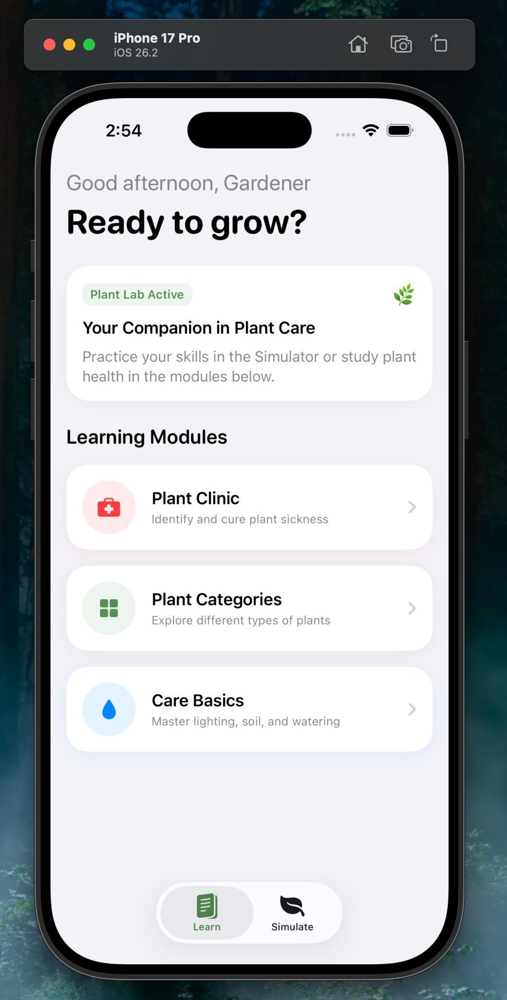
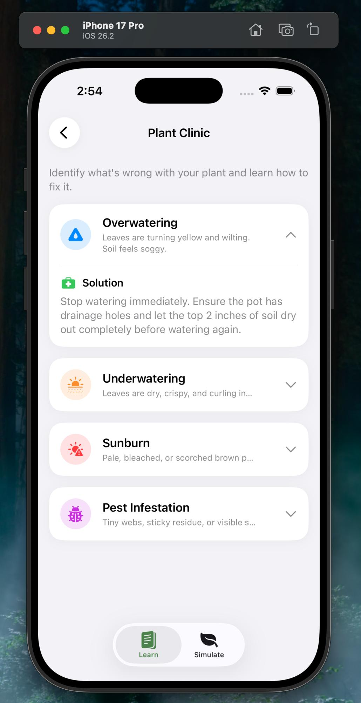
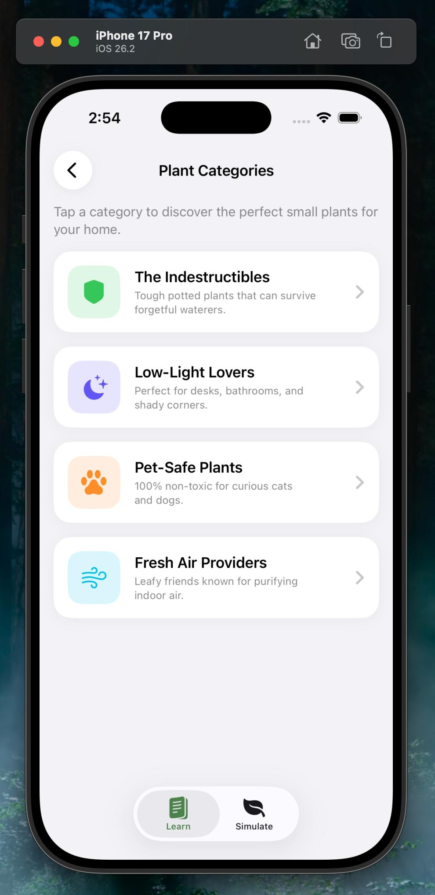
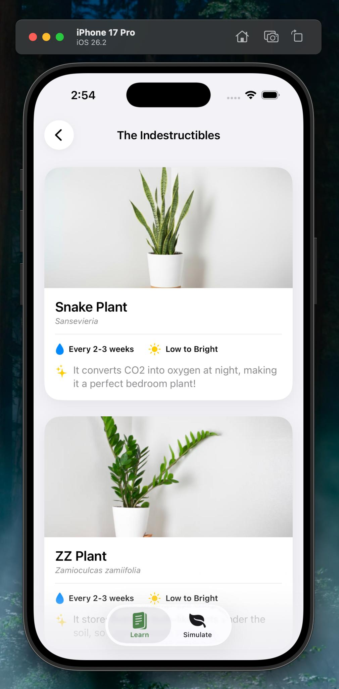
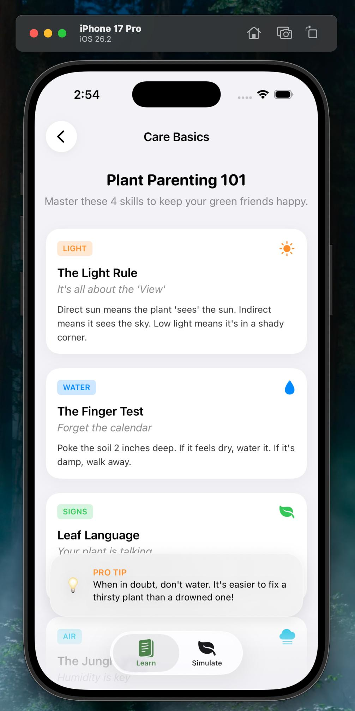
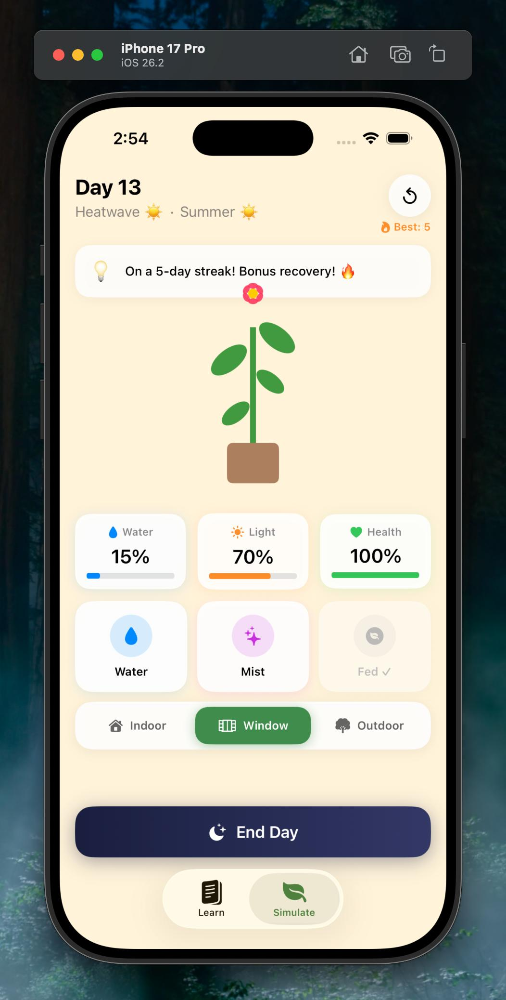
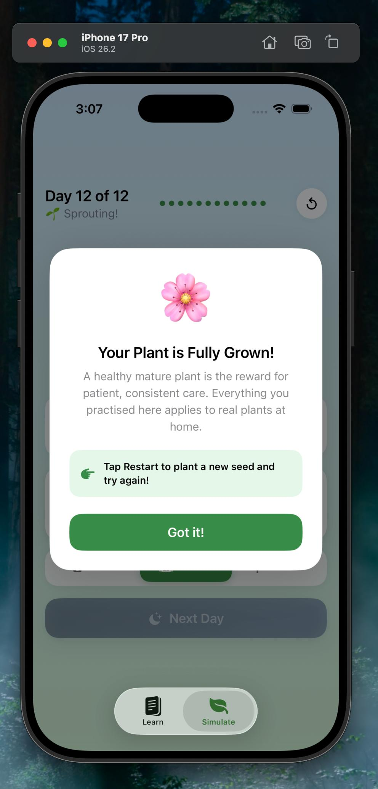
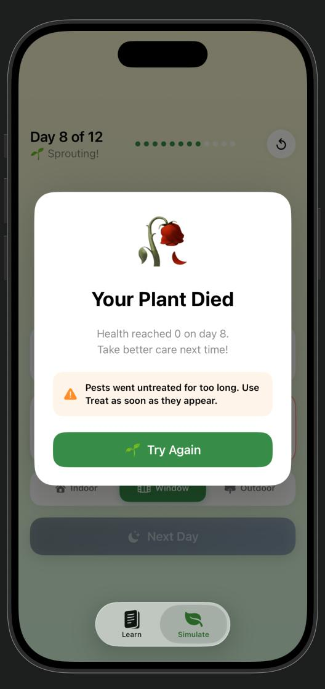

# 🌱 Plantopia
### *Because every dead plant deserved better.*

> An interactive plant care learning app for beginners — built with Swift and SwiftUI.

---

## The Problem

Most beginners kill their first plant without ever knowing why.

Was it too much water? Not enough sun? Pests they never noticed? Plant care feels like guesswork when you are just starting out. Guides tell you what to do but never show you what happens when you get it wrong. And without experiencing the consequences, the knowledge never really sticks.

That frustration — watching a plant you actually liked slowly die — is what Plantopia was built to fix.

---

## What is Plantopia?

Plantopia is an iOS app that teaches plant care through two connected experiences: a structured **Learn** section and a hands-on **12-day plant simulation**.

You do not just read about overwatering. You overwater a plant, watch it turn yellow, and then a lesson card appears explaining exactly why that happened and what to do next. The learning is baked into the experience.

**The app is fully offline. No accounts. No APIs. No internet required.**

---

## How It Works

### 📚 Learn Tab
Three focused modules that build your foundation before you touch a real plant.

| Module | What You Learn |
|--------|----------------|
| 🏥 Plant Clinic | Identify overwatering, underwatering, sunburn, and pest infestations — and how to fix each one |
| 🌿 Plant Categories | Explore indestructible plants, low-light lovers, pet-safe plants, and air purifiers |
| 💧 Care Basics | Master light, the finger-test for watering, reading leaf signals, and humidity |

  
 

---

### 🎮 Simulate Tab
Grow a virtual plant over 12 days. Make real decisions. Face real consequences.

The simulation is scripted so specific things go wrong at specific moments — not randomly, but intentionally — so each failure becomes a lesson.

| Day | Event | What You Learn |
|-----|-------|----------------|
| 1 | Seed just planted | Why seeds need water to germinate |
| 3 | Plant begins sprouting | How photosynthesis fuels growth |
| 5 | Heavy Rain 🌧️ | Why waterlogged soil suffocates roots |
| 7 | Pest Attack 🐛 | How pests attack and how to treat them |
| 10 | Growing strong 🌿 | Why consistency matters more than perfection |
| 12 | Full maturity 🌸 | The reward for patient, steady care |

If the plant dies before day 12, a death screen tells you exactly what went wrong — because failure should teach you something too.

  

---

## Built For

- Beginners buying their first houseplant
- Students living in dorms or small apartments
- Anyone who has killed a plant before and wants to understand why
- People who want to learn by doing, not by reading

---

## Tech Stack

| What | How |
|------|-----|
| Language | Swift |
| UI Framework | SwiftUI |
| State Management | ObservableObject |
| Persistent Storage | AppStorage |
| Haptics | UIImpactFeedbackGenerator |
| Graphics | Custom shapes via SwiftUI Path |
| Connectivity | None — fully offline |

---

## About the Developer

I am a computer science student who also happens to enjoy gardening. I have a small garden at home and I know firsthand how it feels to watch a plant you really liked die because you did not know what it needed. Plantopia came from that exact moment — the frustration of not knowing, and the wish that something had taught me before it was too late.

---

*Submitted for the Apple Swift Student Challenge 2026.*
